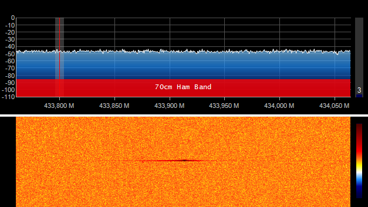
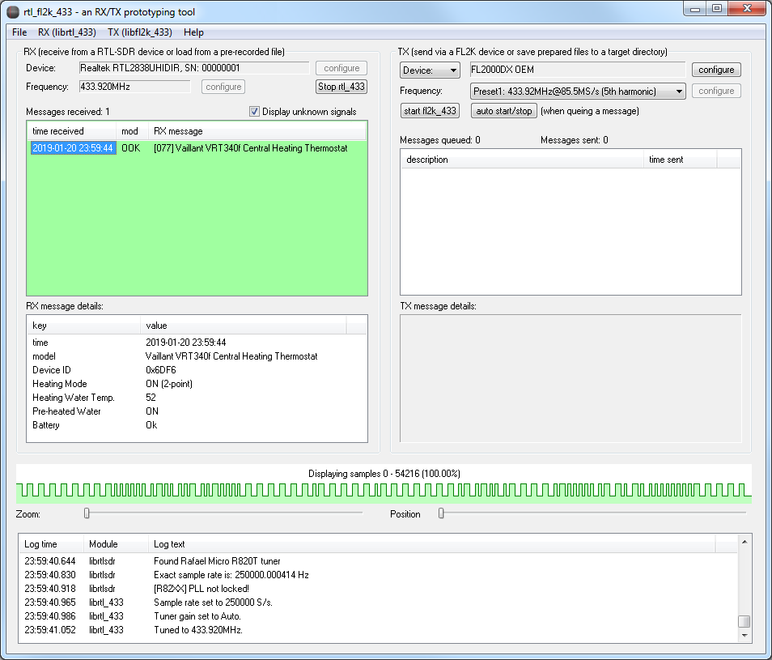
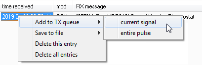
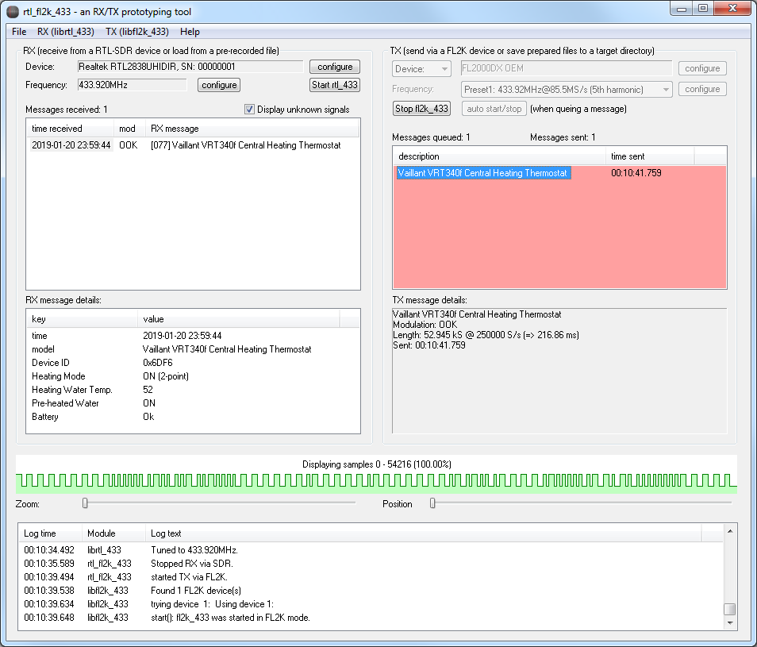
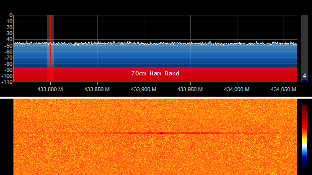

rtl_fl2k_433 - a generic data receiver and transmitter
===========

## Introduction of rtl_fl2k_433
rtl_fl2k_433 is a multi-purpose SDR tool which enables you to use cheap and widely available PC hardware to build a generic data receiver and transmitter working at arbitrary radio frequencies (like the commonly used bands around 315 MHz, 433.92 MHz, 868 MHz, and 915 MHz). It was designed as a quick and handy tool for purposes like prototyping or security analysis.
 
### RX part: hardware and software support
To receive radio signals you need an RTL-SDR compatible USB stick (based on Realteks chipset RTL2832U for DVB-T receivers). The RX logic of rtl_fl2k_433 builds upon librtl_433, which is a custom lib-style modification of the well-known rtl_433 project.

However, if you don't have such a device at hand to receive RX transmission physically, you can still load RX signals into rtl_fl2k_433 from files containing pre-recorded samples.
### TX part: hardware and software support
To transmit radio signals on your own you need a USB3 to VGA adapter based on the Chipset FL2000 by Fresco Logic. The TX logic of rtl_fl2k_433 builds upon a custom library named libfl2k_433, which is an extension to the OSMO-FL2K library released in April 2018.

However, if you don't have such a device at hand, you can let rtl_fl2k_433 save prepared TX signals to your disk which can be sent later using the fl2k_file application (from the OSMO-FL2K software package).
 
## Usage example

You have a device that transmits at 433.92 MHz. In the waterfall plot of the SDR program of your choice (here: SDR#) its signals might look like this:

 
 
In rtl_fl2k_433 you start the reception with an attached RTL-SDR device. Here, a captured message will show up in the reception list. If it uses a known protocol, the decoded data will be listed below.

You can queue any received signal (or the entire pulse sequence which can contain multiple signals) for re-transmission.

Once you start the TX module, the queued signals will be forwarded to your FL2K adapter.

Now other systems within your setup should be able to spot these self-generated signals. In the waterfall plot of the SDR program of your choice (here: SDR#) it might look like this:

## Manual
For detailed instructions refer to

[Detailed manual on RX parts](manual_rx.md)

[Detailed manual on TX parts](manual_tx.md)

## Scope and limitations
As written above, rtl_fl2k_433 is mainly developed for purposes like prototyping or security analysis. It is explicitly not designed for productive use. If you intend to implement a productive use case, you better have a look on the following links
  * For productive RX applications consider using the original, command-line based version of rtl_433. Since it does not perform any GUI handling, it also runs well on cost-efficient and energy-saving hardware like the Raspberry Pi.
  * For productive TX applications consider using transmitters tailored for your intended frequency and modulation. There are cost-efficient solutions, also for small embedded boards like the Raspberry Pi and can be handled easily without requiring you to take special measures against unwanted RF harmonics (as present with FL2K or RpiTX).
 
Current restrictions of rtl_fl2k_433 are:
  * Initially, rtl_fl2k_433 only features Win64 builds. However, the only Windows-specific component is the current GUI, which is based on the Windows API. Since the underlying libraries are not system-dependent, GUIs compatible with further systems should be possible to create without any expected problems. So builds for Linux might follow in future.
  * TX is currently only available for RF signals using On Off Keying (OOK) modulation - which is used by the majority of RF-based devices. Signals using Frequency Shift Keying (FSK), which applies to a smaller number of protocols implemented in rtl_433, cannot be transmitted by rtl_fl2k_433, yet. However, support for FSK transmissions is considered to follow as a future update at some point in time.
  * Currently, you cannot edit the message contents (i.e. its payloads) between reception and transmission - i.e. rtl_fl2k_433 currently cannot be considered as much more than a replay-tool. This would require to add re-modulation logic ontop of librtl_433 which is simply not there, yet. Might follow at some time in future. Currently, you have to record all types of signals first, if you want to be able to reproduce them.
  * TX signals dumped are intended to be used by the fl2k_file tool (see above), Currently, these files cannot be loaded back into rtl_fl2k_433 (this might be added in future)
  * Integration of further SDRs: Currently, only RTL-SDR and FL2K are supported on the RX and TX side, respectively. Especially on the RX side there are no big obstacles to extend this, since rtl_433 meanwhile also supports a bunch of other SDRs via SoapySDR.

## Cautionary advice
Please carefully respect the following advice directly taken from the OSMO-FL2K project. Also rtl_fl2k_433 will show you a reminder prior each first start of its TX module.

If you are operating a radio transmitter of any sort, particularly a DIY solution or a SDR transmitter, it is assumed that you are familiar with both the legal aspects of radio transmissions, as well as the technical aspects of it. Do not operate a radio transmitter unless you are clear of the legal and regulatory requirements. In most jurisdictions the operation of homebrew / DYI transmitters requires at the very least an amateur radio license.

The raw, unfiltered DAC output contains lots of harmonics at multiples of the base frequency. This is what is creatively (ab)used if you use osmo-fl2k to generate a signal much higher than what you could normally achieve with a ~ 165MHz DAC without upconversion. However, this means that the frequency spectrum will contain not only the one desired harmonic, but all the lower harmonics as well as the base frequency.

Before transmitting any signals with an FL2000 device, it is strongly suggested that you check the resulting spectrum with a spectrum analyzer, and apply proper filtering to suppress any but the desired transmit frequency.

Operating a transmitter with the unfiltered FL2000 DAC output attached to an antenna outside a RF shielding chamber is dangerous. Don't do it!
You have the following alternatives to broadcasting over the air:
  * add proper output band pass filtering for your desired TX frequency, or
  * operate transmitter + receiver in a shielded RF box / chamber, or
  * connect transmitter + receiver over coaxial cable (with proper attenuators)
