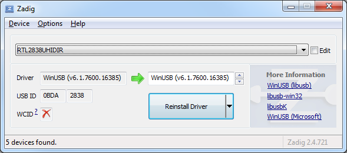
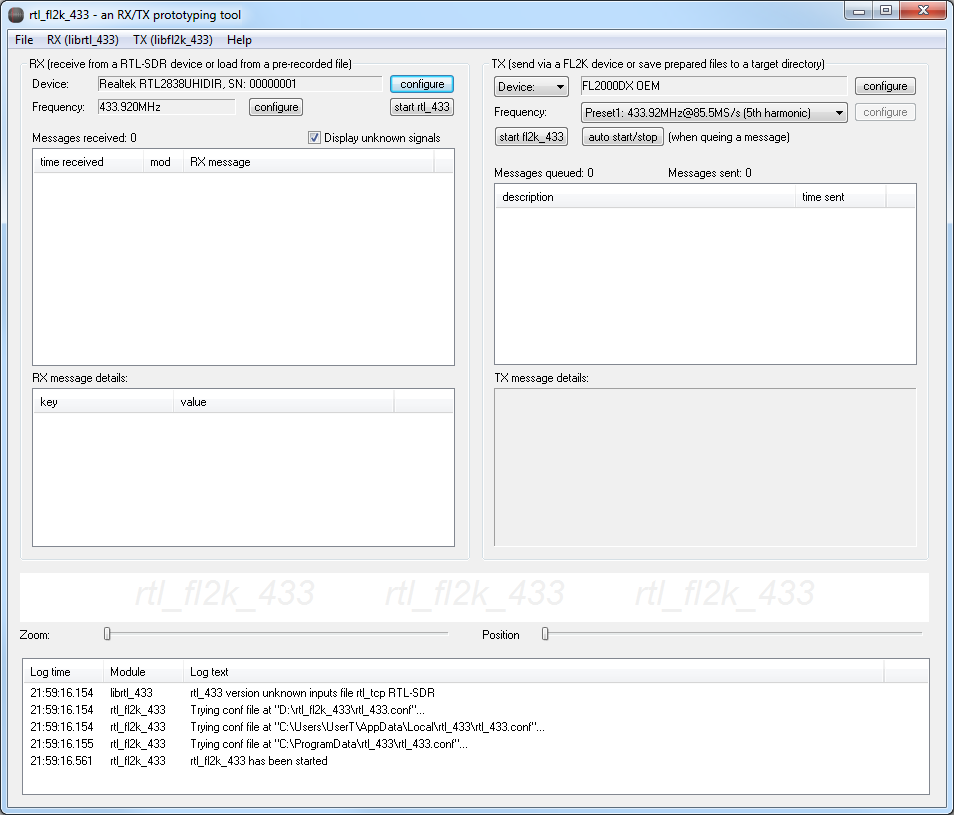
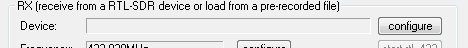
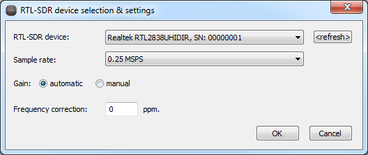
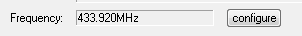
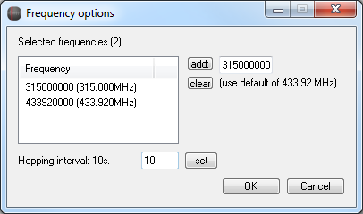
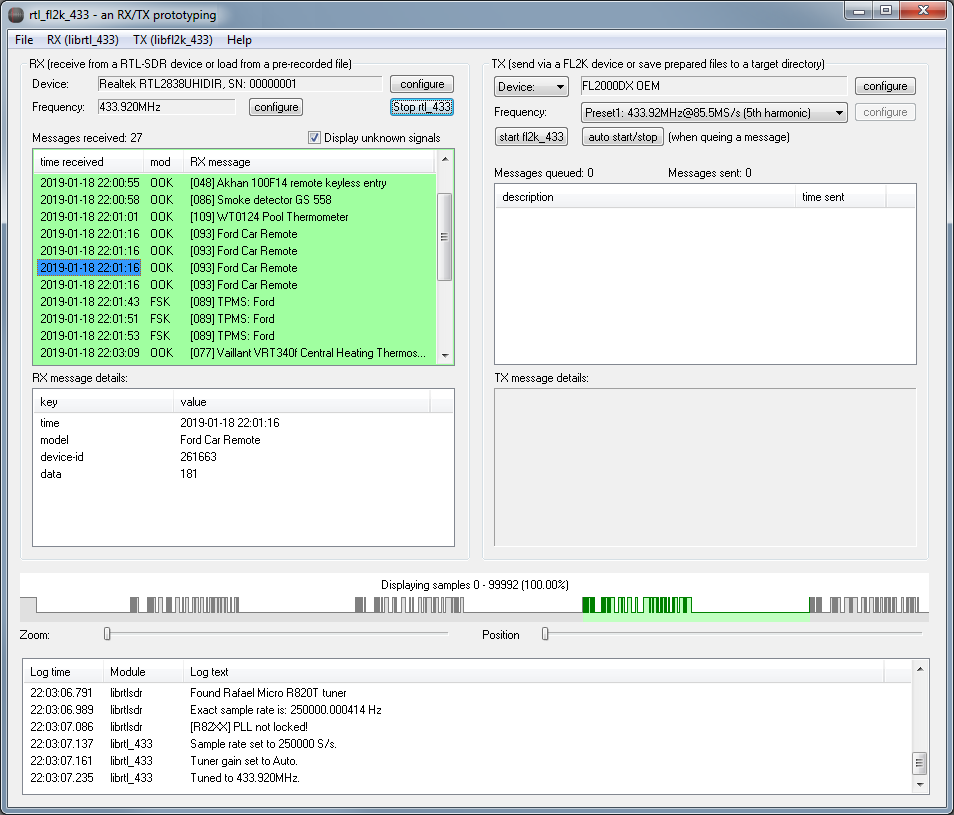
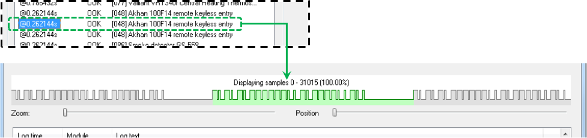
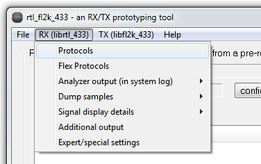
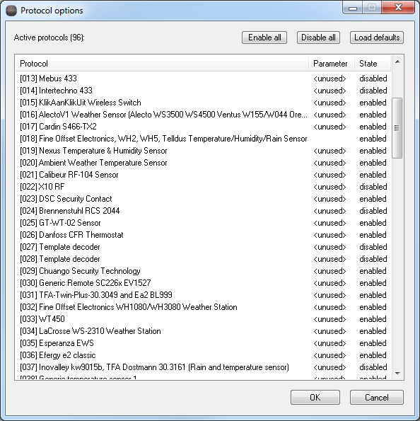

Manual about the RX parts of rtl_fl2k_433
===========

Installing libusb for your RTL-SDR device
----------------------
As for any other SDR-SDR application: Before you can use an RTL2832U-based DVB-T stick (i.e.: an RTL-SDR) in rtl_fl2k_433, you first need to install the libusb driver for it.
An easy way to accomplish this is to use the tool Zadig (https://zadig.akeo.ie/)

In the following example, the WinUSB driver is installed for an RTL-SDR compatible device:

Note that you might have to repeat this step if you attach your RTL-SDR device on a different USB port of your PC.

Selecting the RTL-SDR device in rtl_fl2k_433
----------------------

If you start rtl_fl2k_433 with (exactly) one RTL-SDR attached, you will find this device pre-selected in the upper left:

You can select a(nother) device at any time by pushing the "configure" button:

A device selection dialog will open that lets you select between all RTL-SDR devices currently detected:

Selecting the RX target frequency
----------------------
If your target device uses another frequency as the default of 433.92 MHz, you have to configure the target frequency by pushing the "configure" button next to the frequency listing:

This will open the dialog for the configuration of the RX frequencies:

Note that you can specify multiple target frequencies here that will be iterated through in an configurable hopping interval.

Starting RX
----------------------

Once you start reception by pushing the "start rtl_433" button, the background of the RX list view will turn to green. Arriving messages will be added to that list. Clicking an entry will provide you with detailed information about the received message.

Pulse visualization
----------------------
For the currently selected RX list entry, rtl_fl2k_433 will visualize its underlying pulses in the scope above the system log:

Note that the librtl_433 engine might detect several signals within a single pulse sequence. Therefore, the parts of the current pulse sequence belonging to the currently selected signal are highlighted in green color.

Reading and saving from/to files
----------------------

As an alternative to the SDR reception, you can open pre-recorded files using the main menu: File -> Open (feed to RX).
The rtl_433 engine accepts different file types:
* Raw samples (e.g. 8 bit unsigned / *.cu8)

but also text-based representations like
* OOK/FSK pulse data (*.ook)
* VCD logic (*.vcd)

Note that rtl_fl2k_433 allows you to save each signal from the RX list view in a *.ook or *.vcd text representation. Just right-click it, select "Save to file" and choose between saving the entire pulse sequence or only the parts belonging to the current signal (see above).
The format of the file to be saved can be chosen in the following file selection dialog.

Configuration
----------------------
Several configuration options for the rtl_433 engine can be found in the main menu in the RX (librtl_433) section:

* "Protocols"
Here you can enable/disable the protocols supported by librtl_433. Also you can set parameters for protocols supporting this (see screenshot below).
* "Flex Protocols"
Here you load text-based specifications for adding "flex" protocols to the librtl_433 engine.
* "Analyzer output (in system log)"
This allows you to activate some analysis features of librtl_433 (will show up in the system log during operation).
* "Dump samples"
Configure dumping facilities of librtl_433.
* "Signal display details"
Lets you enable some additional display details like high-resolution time stamps.
* "Additional output"
Lets you enable additional modules for decoded output (e.g. CSV files)
* "Expert/special settings"
Here you can change some special settings like verbosity level (affects log granularity of librtl_433)

