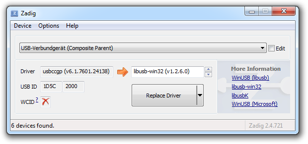
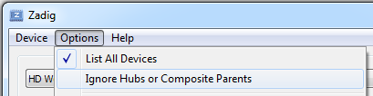
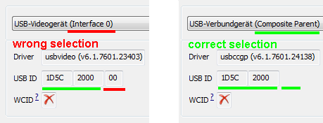
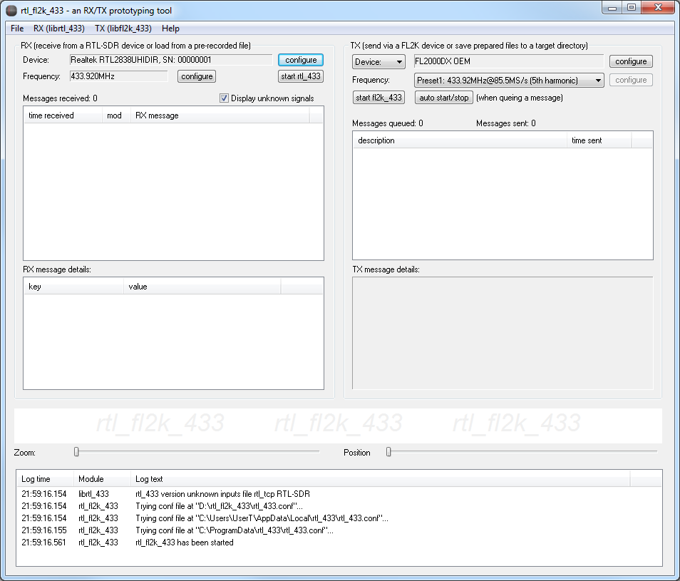
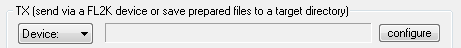
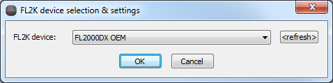
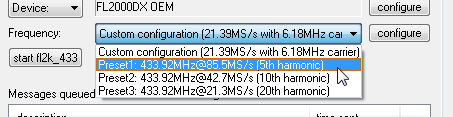
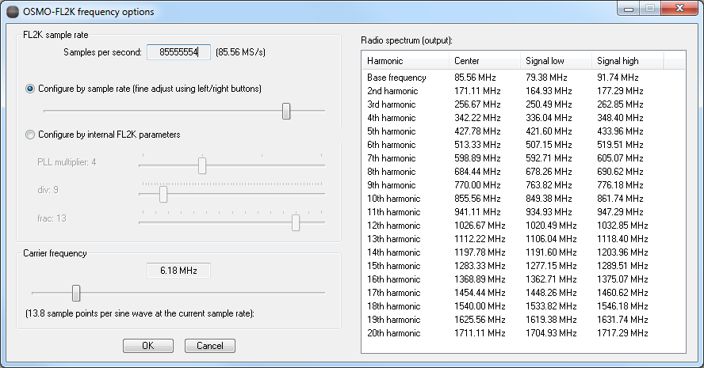
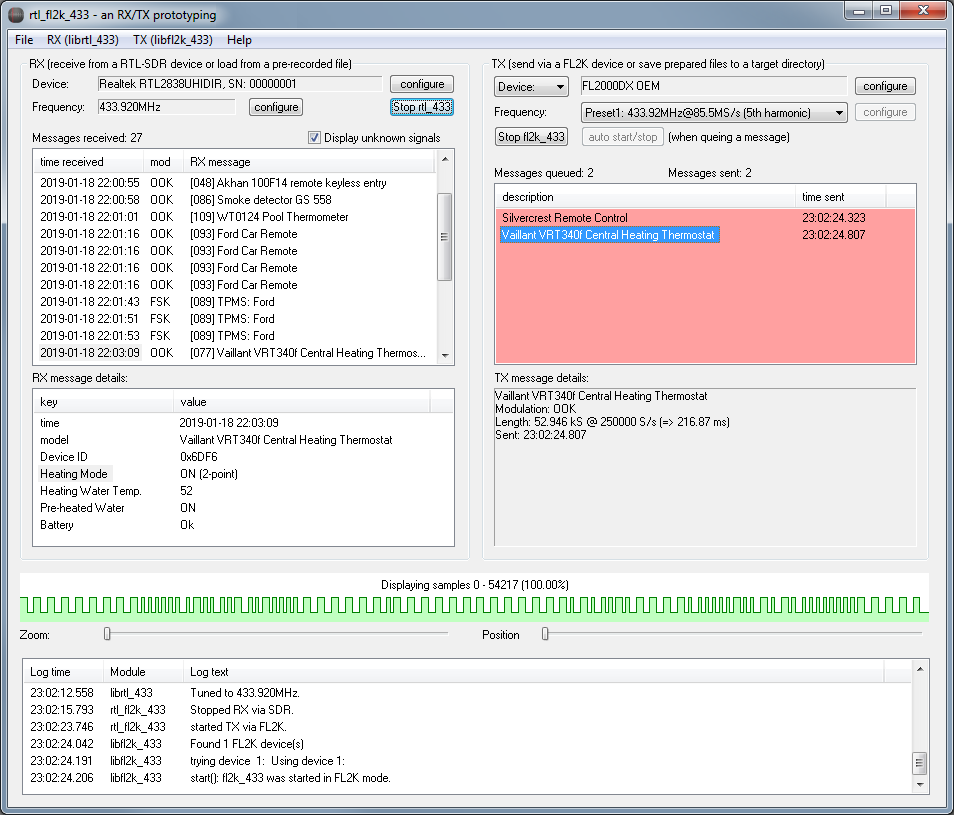

Manual about the TX parts of rtl_fl2k_433
===========

Installing libusb for your FL2K device
----------------------
Before you can use an Fl2000-based USB3 to VGA adapter in rtl_fl2k_433, you first need to install the libusb driver for it.
An easy way to accomplish this is to use the tool Zadig (https://zadig.akeo.ie/)

Just install the libusb-win32 driver for your FL2K device. On all FL2K adapters I've seen so far, the USB ID was "1D5C 2000".

Note that the FL2000 chipset is a composite device which can present two child devices to the host computer: the VGA adapter and an (optional) flash drive containing the VGA drivers. Take care to install the libusb driver for the composite parent. You might have to (un)set these checkmarks to let Zadig show it:

You can determine the right selection by the "Composite Parent" annotation or by the missing suffix of the USB id:

Note that you might have to repeat this step if you attach your FL2K device on a different USB3 port of your PC.

Selecting the FL2K device in rtl_fl2k_433
----------------------

If you start rtl_fl2k_433 with (exactly) one FL2K adapter attached, you will find this device pre-selected in the upper right:

You can select a(nother) device at any time by pushing the "configure" button:

A device selection dialog will open that lets you select between all FL2K devices currently detected:

Selecting the TX target frequency
----------------------
Ensure you have a correct setting loaded for the target frequency of your application.

In rtl_fl2k_433 you can either select from some presets:

(more presets might follow in future)

Or you select the first entry for a custom configuration and use the "configure" button to adjust the frequency settings:

This dialog lets you basically select a combination of the FL2K sample rate (in samples per second) and the frequency of the carrier wave (in MHz) which is used for on-off-keying transmission.

When outputting the carrier wave, the FL2K adapter will produce harmonics on (n\*samplerate) +/- carrier frequency.

For example: If you run your FL2K device at a sample rate of 85,555,554 samples/second and output a sine wave with a frequency of 6,180,000 Hz you will observe signals on the 5th harmonic at (5\*85,555,554) - 6,180,000 = 421,597,770 Hz and (5\*85,555,554) + 6,180,000 = 433,957,770 Hz

On the right side you see a list of the expected harmonics given your current configuration.

Keep in mind that the signal gets weaker with every additional harmonic:

(image taken from https://www.rtl-sdr.com/setting-up-and-testing-osmo-fl2k/)

Starting TX
----------------------

rtl_fl2k_433 provides two options to start transmission of queued signals:

 * "start fl2k_433"

Pushing this button will initialize FL2K and starting to output a null (0 Hz) signal. It will keep running and ready to pick up each TX message you queue. This will last until you manually stop the FL2K device by pushing the button (which was renamed meanwhile in "stop fl2k_433") again.
 
 * auto start/stop

Pushing this button will cause TX to start and stop automatically after new TX messages were queued and, respectively, processed. This means, the FL2K device will be deactivated while the TX queue does not contain any unsent messages.

Both modes have their advantages and shortcomings.

* The main advantage of the manual start/stop mode is that newly added TX messages will be sent with a very low latency since the FL2K device is already initialized.
The auto start/stop mode will take some time (< 1 sec) until a newly added TX message is physically sent, if the FL2K device was previously stopped.

* However, FL2K transmissions seem to be prone to breakdowns of their output signal which might not be detected by the controlling program. Therefore, the auto start/stop mode is the recommended mode, because it reduces the usage of the FL2K device and maximizes the chance that the signals will effectively be transmitted.

While TX is active, the background of the TX queue will turn to red:

